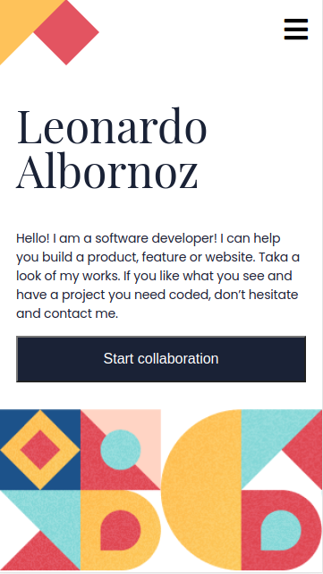

# Personal Portfolio

> One paragraph statement about the project.



Additional description about the project and its features.

## Built With

- HTML
- SASS
- npm

## Live Demo

[Live Demo Link](https://leboroz.github.io/personal-portfolio/views)


## Getting Started


To get a local copy up follow these simple example steps.

### Prerequisites
- GIT

### Setup

Open a terminal or a git bash in the desired directory and run ```git clone https://github.com/Leboroz/personal-portfolio.git```

## Authors

👤 **Leonardo Albornoz**

- GitHub: [@Leboroz](https://github.com/leboroz)
- Twitter: [@Leboroz](https://twitter.com/leboroz)
- LinkedIn: [Leonardo Albornoz](https://linkedin.com/in/linkedinhandle)

## 🤝 Contributing

Contributions, issues, and feature requests are welcome!

Feel free to check the [issues page](https://github.com/Leboroz/personal-portfolio/issues).

## Show your support

Give a ⭐️ if you like this project!

## Acknowledgments

- Hat tip to anyone whose code was used
- Inspiration
- etc

## 📝 License

This project is [MIT](./MIT.md) licensed.
